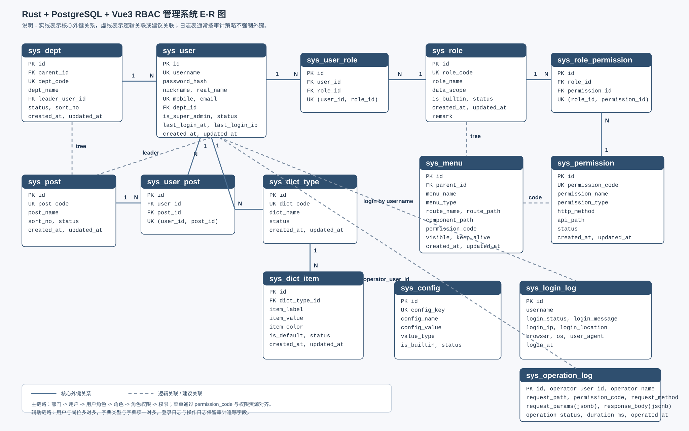

# 基于 Rust + PostgreSQL + Vue3 的 RBAC 管理系统需求分析

## 1. 项目背景

面向企业后台、运营平台、SaaS 控制台等场景，设计并实现一套通用型管理系统。系统以前后端分离方式开发，后端采用 Rust，数据库采用 PostgreSQL，前端采用 Vue3，并基于 RBAC（Role-Based Access Control，基于角色的访问控制）实现统一的权限管理能力。

该系统目标不是只完成“用户登录 + 菜单控制”，而是沉淀一套可扩展、可审计、可配置、可复用的中后台基础平台，为后续业务模块接入提供统一规范。

## 2. 建设目标

## 2.1 核心目标

1. 提供标准化用户、角色、权限、组织管理能力。
2. 支持页面权限、菜单权限、按钮权限、接口权限的统一控制。
3. 支持多角色授权与权限聚合。
4. 支持操作日志、登录日志、审计追踪。
5. 支持后续业务模块快速接入，不需要重复建设权限体系。

## 2.2 技术目标

1. 后端具备高性能、类型安全、易维护特性。
2. 数据库具备良好的事务一致性、约束能力与扩展性。
3. 前端具备组件化、动态路由、可配置菜单与良好交互体验。
4. 系统架构支持模块化、分层设计与二次开发。

## 3. 用户与角色分析

## 3.1 目标用户

1. 平台超级管理员：负责系统初始化、租户或组织管理、权限模型维护。
2. 系统管理员：负责用户、角色、菜单、部门、岗位等基础管理。
3. 业务管理员：负责业务模块配置、数据审批、人员授权。
4. 普通操作员：按授权访问具体菜单和功能。
5. 审计人员：查看日志、追踪操作记录、导出审计报表。

## 3.2 角色特点

1. 一个用户可以拥有多个角色。
2. 一个角色可以关联多个权限点。
3. 角色权限变更后，需快速同步到用户授权结果。
4. 角色应区分“系统内置角色”和“自定义角色”。

## 4. 业务范围

## 4.1 本期范围

1. 认证与授权。
2. RBAC 权限模型。
3. 组织架构管理。
4. 用户、角色、菜单、部门、岗位管理。
5. 系统配置与字典管理。
6. 日志审计与安全控制。
7. 基础仪表盘与通用后台框架。

## 4.2 后续扩展范围

1. 多租户管理。
2. 工作流审批。
3. 消息通知中心。
4. 文件中心。
5. API Key、开放平台、第三方 SSO。
6. 数据权限模型（行级、列级权限）。

## 5. 功能需求分析

## 5.1 认证中心

### 5.1.1 登录

1. 支持账号密码登录。
2. 支持验证码或图形校验，防止暴力破解。
3. 支持记住登录状态、Token 刷新。
4. 支持账号锁定、密码错误次数限制。

### 5.1.2 退出登录

1. 支持主动退出。
2. 支持服务端失效 Token。
3. 支持单端退出与全端退出扩展能力。

### 5.1.3 身份安全

1. 密码加密存储。
2. 支持密码强度校验。
3. 支持密码定期过期策略。
4. 支持后续扩展双因素认证。

## 5.2 用户管理

1. 支持用户新增、编辑、删除、禁用、启用。
2. 支持用户基础资料维护：用户名、昵称、手机号、邮箱、状态、部门、岗位。
3. 支持为用户分配一个或多个角色。
4. 支持重置密码。
5. 支持批量导入、导出。
6. 支持按用户名、手机号、部门、状态搜索。

## 5.3 角色管理

1. 支持角色新增、编辑、删除、启用、禁用。
2. 支持角色编码唯一约束。
3. 支持角色与菜单权限、按钮权限、接口权限关联。
4. 支持角色排序与显示控制。
5. 支持内置角色保护，避免误删核心角色。

## 5.4 权限管理

### 5.4.1 权限模型

权限建议拆分为以下类型：

1. 菜单权限：控制左侧导航与页面入口展示。
2. 路由权限：控制页面访问能力。
3. 按钮权限：控制新增、编辑、删除、导出、审批等操作按钮。
4. 接口权限：控制后端 API 是否允许调用。
5. 数据权限：控制能查看哪些部门、哪些人员、哪些业务数据。

### 5.4.2 授权规则

1. 用户最终权限 = 用户所有角色权限并集。
2. 超级管理员默认拥有所有权限。
3. 未授权默认拒绝访问。
4. 前端负责展示控制，后端负责最终鉴权。
5. 权限变更后需要支持缓存刷新与实时生效。

## 5.5 菜单管理

1. 支持目录、菜单、按钮三种节点类型。
2. 支持多级树形结构。
3. 支持图标、排序、路由地址、组件路径、是否缓存、是否隐藏配置。
4. 支持前端动态路由生成。
5. 支持菜单与权限标识绑定。

## 5.6 部门与组织管理

1. 支持树形组织结构维护。
2. 支持部门新增、编辑、删除、排序。
3. 支持部门负责人配置。
4. 支持用户归属部门。
5. 为后续数据权限按部门隔离提供基础能力。

## 5.7 岗位管理

1. 支持岗位新增、编辑、删除。
2. 支持岗位编码、名称、状态、排序。
3. 支持用户与岗位关联。

## 5.8 字典管理

1. 支持字典类型管理。
2. 支持字典项管理。
3. 前后端统一读取字典值，用于状态、类型、标签等可配置枚举场景。

## 5.9 系统参数配置

1. 支持系统参数新增、编辑、删除。
2. 支持参数分组与分类。
3. 支持缓存加载，提高读取效率。
4. 支持配置变更审计。

## 5.10 日志与审计

### 5.10.1 登录日志

1. 记录登录账号、IP、设备、浏览器、时间、结果。
2. 支持失败原因记录。
3. 支持按时间范围检索。

### 5.10.2 操作日志

1. 记录谁在什么时间对什么模块做了什么操作。
2. 记录请求路径、请求参数、响应结果、耗时。
3. 对敏感字段进行脱敏处理。
4. 支持导出与归档。

### 5.10.3 审计要求

1. 关键操作必须可追溯。
2. 权限变更、角色变更、用户状态变更必须记录。
3. 审计日志原则上不可直接物理删除，可做归档管理。

## 5.11 首页与仪表盘

1. 展示用户欢迎信息、快捷入口。
2. 展示系统运行概览，如用户数、角色数、今日登录数。
3. 预留业务统计卡片与图表区域。

## 6. 非功能需求分析

## 6.1 性能要求

1. 常规查询接口响应时间控制在 200ms 到 500ms。
2. 列表分页、索引优化、缓存机制应纳入设计。
3. 支持高并发登录与权限校验场景。

## 6.2 安全要求

1. 所有敏感接口必须鉴权。
2. 密码必须加盐哈希存储。
3. 防止 SQL 注入、XSS、CSRF、暴力破解。
4. 日志中不得明文记录敏感信息。
5. 支持 IP 黑名单、账号锁定等安全策略扩展。

## 6.3 可维护性要求

1. 后端代码分层清晰，领域边界明确。
2. 前端组件、页面、状态管理清晰可复用。
3. 数据库表结构命名统一，字段规范明确。
4. 核心模块具备测试用例与接口文档。

## 6.4 可扩展性要求

1. 支持后续新增租户维度。
2. 支持新增业务模块时复用权限体系。
3. 支持从 RBAC 平滑扩展到 RBAC + 数据权限模型。

## 6.5 可用性要求

1. 界面交互清晰，适合后台管理场景。
2. 支持响应式布局，兼容主流桌面浏览器。
3. 表单校验、错误提示、空状态展示完整。

## 7. 技术架构需求

## 7.1 后端架构建议

技术栈建议：

1. Rust Web 框架：Axum 或 Actix Web。
2. ORM / 数据访问：SQLx 或 SeaORM。
3. 鉴权：JWT + Refresh Token。
4. 缓存：Redis。
5. 配置管理：dotenv + config。
6. 日志：tracing + tracing-subscriber。

后端分层建议：

1. `api` 层：接收请求、参数校验、返回统一响应。
2. `service` 层：业务逻辑编排。
3. `domain` 层：领域模型、业务规则。
4. `repository` 层：数据库访问。
5. `middleware` 层：认证、日志、异常处理、权限拦截。

## 7.2 数据库架构建议

数据库采用 PostgreSQL，重点利用以下能力：

1. 强事务一致性。
2. 丰富索引能力。
3. JSONB 扩展字段支持。
4. 适合复杂查询与审计数据管理。

## 7.3 前端架构建议

技术栈建议：

1. Vue3 + TypeScript。
2. Vite。
3. Pinia。
4. Vue Router。
5. Element Plus 或 Naive UI。
6. Axios 或封装请求客户端。

前端能力要求：

1. 动态路由生成。
2. 按钮级权限指令。
3. 通用表格、表单、弹窗组件封装。
4. 登录态管理与自动刷新。
5. 主题配置与国际化扩展预留。

## 8. RBAC 模型设计要求

## 8.1 核心实体

1. 用户 `sys_user`
2. 角色 `sys_role`
3. 权限资源 `sys_permission`
4. 菜单 `sys_menu`
5. 用户角色关联 `sys_user_role`
6. 角色权限关联 `sys_role_permission`
7. 部门 `sys_dept`
8. 岗位 `sys_post`
9. 日志表 `sys_login_log`、`sys_operation_log`

## 8.2 实体关系

1. 用户和角色是多对多关系。
2. 角色和权限是多对多关系。
3. 菜单是权限资源的一种表现形式，也可以单独建表后关联权限标识。
4. 用户属于一个部门，也可以扩展支持兼职多部门。
5. 岗位与用户通常是一对多或多对多，可按业务复杂度决定。

## 8.3 权限标识规范

建议统一使用如下格式：

```text
system:user:list
system:user:create
system:user:update
system:user:delete
system:role:assign
```

优点：

1. 易读。
2. 易检索。
3. 易与前后端按钮权限统一。

## 9. 核心业务流程

## 9.1 登录授权流程

1. 用户输入账号密码。
2. 后端校验账号状态、密码正确性、验证码。
3. 登录成功后签发 Access Token 和 Refresh Token。
4. 后端返回用户基础信息、角色信息、权限集合。
5. 前端根据菜单权限生成动态路由并缓存登录态。

## 9.2 页面访问流程

1. 用户访问页面路由。
2. 前端判断是否已登录。
3. 前端根据已加载路由与权限决定是否展示页面。
4. 后端接口再次校验 Token 与权限标识。
5. 未授权请求返回统一错误码。

## 9.3 授权变更流程

1. 管理员修改角色权限。
2. 系统更新角色与权限关联关系。
3. 清理相关缓存。
4. 用户下次请求时加载新权限，或通过版本机制立即刷新。

## 10. 接口需求概览

建议至少包含以下接口分类：

1. 认证接口：登录、登出、刷新 Token、获取当前用户信息。
2. 用户接口：分页、详情、新增、编辑、删除、重置密码、分配角色。
3. 角色接口：分页、详情、新增、编辑、删除、分配权限。
4. 菜单接口：树查询、新增、编辑、删除。
5. 部门接口：树查询、新增、编辑、删除。
6. 岗位接口：分页、新增、编辑、删除。
7. 字典接口：类型管理、字典项管理。
8. 日志接口：登录日志、操作日志查询与导出。

## 11. 页面需求概览

前端至少包含以下页面：

1. 登录页。
2. 首页仪表盘。
3. 用户管理页。
4. 角色管理页。
5. 菜单管理页。
6. 部门管理页。
7. 岗位管理页。
8. 字典管理页。
9. 系统参数页。
10. 登录日志页。
11. 操作日志页。
12. 个人中心页。

## 12. 权限控制粒度要求

## 12.1 前端控制

1. 菜单是否显示。
2. 页面是否可进入。
3. 按钮是否显示或禁用。
4. 部分字段是否可编辑。

## 12.2 后端控制

1. 接口访问拦截。
2. 数据范围校验。
3. 敏感操作二次确认或二次校验扩展。

## 13. 数据库表设计建议

建议优先落地以下主表：

1. `sys_user`
2. `sys_role`
3. `sys_permission`
4. `sys_menu`
5. `sys_user_role`
6. `sys_role_permission`
7. `sys_dept`
8. `sys_post`
9. `sys_user_post`
10. `sys_dict_type`
11. `sys_dict_item`
12. `sys_config`
13. `sys_login_log`
14. `sys_operation_log`

通用字段建议：

1. `id`
2. `created_at`
3. `updated_at`
4. `created_by`
5. `updated_by`
6. `is_deleted` 或状态字段
7. `remark`

## 13.1 数据库设计原则

1. 所有系统表统一使用 `sys_` 前缀，便于区分业务表与系统表。
2. 主键建议统一使用 `bigserial` 或 `bigint` + 雪花 ID。
3. 所有时间字段统一使用 `timestamp with time zone` 或 `timestamptz`。
4. 状态字段建议使用小整数或短字符串枚举，避免语义不清。
5. 多对多关系必须使用中间表，不直接在主表存储逗号分隔 ID。
6. 高频查询字段必须建立索引。
7. 审计类表建议预留归档策略，不与核心事务表混用。

## 13.2 核心表详细设计

### 13.2.1 用户表 `sys_user`

用途：存储系统登录用户及基础身份信息。

| 字段名 | 类型 | 约束 | 说明 |
| --- | --- | --- | --- |
| id | bigint | PK | 用户 ID |
| username | varchar(64) | NOT NULL, UNIQUE | 登录账号 |
| password_hash | varchar(255) | NOT NULL | 密码哈希 |
| nickname | varchar(64) | NOT NULL | 用户昵称 |
| real_name | varchar(64) | NULL | 真实姓名 |
| mobile | varchar(32) | NULL, UNIQUE | 手机号 |
| email | varchar(128) | NULL, UNIQUE | 邮箱 |
| avatar_url | varchar(255) | NULL | 头像地址 |
| gender | smallint | NULL | 性别，0未知/1男/2女 |
| dept_id | bigint | NULL | 所属部门 ID |
| status | smallint | NOT NULL DEFAULT 1 | 状态，1启用/0禁用 |
| is_super_admin | boolean | NOT NULL DEFAULT false | 是否超管 |
| last_login_at | timestamptz | NULL | 最后登录时间 |
| last_login_ip | varchar(64) | NULL | 最后登录 IP |
| password_updated_at | timestamptz | NULL | 最近一次修改密码时间 |
| created_at | timestamptz | NOT NULL | 创建时间 |
| updated_at | timestamptz | NOT NULL | 更新时间 |
| created_by | bigint | NULL | 创建人 |
| updated_by | bigint | NULL | 更新人 |
| is_deleted | boolean | NOT NULL DEFAULT false | 逻辑删除标记 |
| remark | varchar(500) | NULL | 备注 |

索引建议：

1. `uk_sys_user_username (username)`
2. `uk_sys_user_mobile (mobile)`
3. `idx_sys_user_dept_id (dept_id)`
4. `idx_sys_user_status (status)`

### 13.2.2 角色表 `sys_role`

用途：存储角色定义。

| 字段名 | 类型 | 约束 | 说明 |
| --- | --- | --- | --- |
| id | bigint | PK | 角色 ID |
| role_name | varchar(64) | NOT NULL | 角色名称 |
| role_code | varchar(64) | NOT NULL, UNIQUE | 角色编码 |
| role_sort | integer | NOT NULL DEFAULT 0 | 排序 |
| data_scope | varchar(32) | NULL | 数据权限范围 |
| status | smallint | NOT NULL DEFAULT 1 | 状态 |
| is_builtin | boolean | NOT NULL DEFAULT false | 是否系统内置 |
| created_at | timestamptz | NOT NULL | 创建时间 |
| updated_at | timestamptz | NOT NULL | 更新时间 |
| created_by | bigint | NULL | 创建人 |
| updated_by | bigint | NULL | 更新人 |
| is_deleted | boolean | NOT NULL DEFAULT false | 逻辑删除 |
| remark | varchar(500) | NULL | 备注 |

索引建议：

1. `uk_sys_role_role_code (role_code)`
2. `idx_sys_role_status (status)`
3. `idx_sys_role_sort (role_sort)`

### 13.2.3 权限资源表 `sys_permission`

用途：统一描述接口、按钮、路由等权限点。

| 字段名 | 类型 | 约束 | 说明 |
| --- | --- | --- | --- |
| id | bigint | PK | 权限 ID |
| permission_name | varchar(128) | NOT NULL | 权限名称 |
| permission_code | varchar(128) | NOT NULL, UNIQUE | 权限标识 |
| permission_type | varchar(32) | NOT NULL | 权限类型，如 menu/button/api/data |
| http_method | varchar(16) | NULL | 接口方法 |
| api_path | varchar(255) | NULL | 接口路径 |
| status | smallint | NOT NULL DEFAULT 1 | 状态 |
| created_at | timestamptz | NOT NULL | 创建时间 |
| updated_at | timestamptz | NOT NULL | 更新时间 |
| created_by | bigint | NULL | 创建人 |
| updated_by | bigint | NULL | 更新人 |
| is_deleted | boolean | NOT NULL DEFAULT false | 逻辑删除 |
| remark | varchar(500) | NULL | 备注 |

索引建议：

1. `uk_sys_permission_code (permission_code)`
2. `idx_sys_permission_type (permission_type)`
3. `idx_sys_permission_api_path (api_path)`

### 13.2.4 菜单表 `sys_menu`

用途：描述前端菜单、目录、按钮节点及路由配置。

| 字段名 | 类型 | 约束 | 说明 |
| --- | --- | --- | --- |
| id | bigint | PK | 菜单 ID |
| parent_id | bigint | NOT NULL DEFAULT 0 | 父节点 ID |
| menu_name | varchar(64) | NOT NULL | 菜单名称 |
| menu_type | varchar(16) | NOT NULL | catalog/menu/button |
| route_name | varchar(64) | NULL | 路由名称 |
| route_path | varchar(255) | NULL | 路由路径 |
| component_path | varchar(255) | NULL | 前端组件路径 |
| permission_code | varchar(128) | NULL | 对应权限标识 |
| icon | varchar(64) | NULL | 图标 |
| sort_no | integer | NOT NULL DEFAULT 0 | 排序 |
| visible | boolean | NOT NULL DEFAULT true | 是否可见 |
| keep_alive | boolean | NOT NULL DEFAULT false | 是否缓存 |
| is_external | boolean | NOT NULL DEFAULT false | 是否外链 |
| status | smallint | NOT NULL DEFAULT 1 | 状态 |
| created_at | timestamptz | NOT NULL | 创建时间 |
| updated_at | timestamptz | NOT NULL | 更新时间 |
| created_by | bigint | NULL | 创建人 |
| updated_by | bigint | NULL | 更新人 |
| is_deleted | boolean | NOT NULL DEFAULT false | 逻辑删除 |
| remark | varchar(500) | NULL | 备注 |

索引建议：

1. `idx_sys_menu_parent_id (parent_id)`
2. `idx_sys_menu_sort_no (sort_no)`
3. `idx_sys_menu_permission_code (permission_code)`

### 13.2.5 用户角色关联表 `sys_user_role`

用途：维护用户与角色的多对多关系。

| 字段名 | 类型 | 约束 | 说明 |
| --- | --- | --- | --- |
| id | bigint | PK | 主键 |
| user_id | bigint | NOT NULL | 用户 ID |
| role_id | bigint | NOT NULL | 角色 ID |
| created_at | timestamptz | NOT NULL | 创建时间 |
| created_by | bigint | NULL | 创建人 |

约束与索引建议：

1. 唯一约束 `uk_sys_user_role_user_role (user_id, role_id)`
2. 索引 `idx_sys_user_role_user_id (user_id)`
3. 索引 `idx_sys_user_role_role_id (role_id)`

### 13.2.6 角色权限关联表 `sys_role_permission`

用途：维护角色与权限的多对多关系。

| 字段名 | 类型 | 约束 | 说明 |
| --- | --- | --- | --- |
| id | bigint | PK | 主键 |
| role_id | bigint | NOT NULL | 角色 ID |
| permission_id | bigint | NOT NULL | 权限 ID |
| created_at | timestamptz | NOT NULL | 创建时间 |
| created_by | bigint | NULL | 创建人 |

约束与索引建议：

1. 唯一约束 `uk_sys_role_permission_role_permission (role_id, permission_id)`
2. 索引 `idx_sys_role_permission_role_id (role_id)`
3. 索引 `idx_sys_role_permission_permission_id (permission_id)`

### 13.2.7 部门表 `sys_dept`

用途：维护组织树。

| 字段名 | 类型 | 约束 | 说明 |
| --- | --- | --- | --- |
| id | bigint | PK | 部门 ID |
| parent_id | bigint | NOT NULL DEFAULT 0 | 父部门 ID |
| dept_name | varchar(64) | NOT NULL | 部门名称 |
| dept_code | varchar(64) | NULL, UNIQUE | 部门编码 |
| leader_user_id | bigint | NULL | 部门负责人 |
| sort_no | integer | NOT NULL DEFAULT 0 | 排序 |
| status | smallint | NOT NULL DEFAULT 1 | 状态 |
| created_at | timestamptz | NOT NULL | 创建时间 |
| updated_at | timestamptz | NOT NULL | 更新时间 |
| created_by | bigint | NULL | 创建人 |
| updated_by | bigint | NULL | 更新人 |
| is_deleted | boolean | NOT NULL DEFAULT false | 逻辑删除 |
| remark | varchar(500) | NULL | 备注 |

索引建议：

1. `uk_sys_dept_dept_code (dept_code)`
2. `idx_sys_dept_parent_id (parent_id)`
3. `idx_sys_dept_status (status)`

### 13.2.8 岗位表 `sys_post`

用途：维护岗位信息。

| 字段名 | 类型 | 约束 | 说明 |
| --- | --- | --- | --- |
| id | bigint | PK | 岗位 ID |
| post_name | varchar(64) | NOT NULL | 岗位名称 |
| post_code | varchar(64) | NOT NULL, UNIQUE | 岗位编码 |
| sort_no | integer | NOT NULL DEFAULT 0 | 排序 |
| status | smallint | NOT NULL DEFAULT 1 | 状态 |
| created_at | timestamptz | NOT NULL | 创建时间 |
| updated_at | timestamptz | NOT NULL | 更新时间 |
| created_by | bigint | NULL | 创建人 |
| updated_by | bigint | NULL | 更新人 |
| is_deleted | boolean | NOT NULL DEFAULT false | 逻辑删除 |
| remark | varchar(500) | NULL | 备注 |

索引建议：

1. `uk_sys_post_post_code (post_code)`
2. `idx_sys_post_status (status)`

### 13.2.9 用户岗位关联表 `sys_user_post`

用途：维护用户与岗位的关联关系。

| 字段名 | 类型 | 约束 | 说明 |
| --- | --- | --- | --- |
| id | bigint | PK | 主键 |
| user_id | bigint | NOT NULL | 用户 ID |
| post_id | bigint | NOT NULL | 岗位 ID |
| created_at | timestamptz | NOT NULL | 创建时间 |
| created_by | bigint | NULL | 创建人 |

约束与索引建议：

1. 唯一约束 `uk_sys_user_post_user_post (user_id, post_id)`
2. 索引 `idx_sys_user_post_user_id (user_id)`
3. 索引 `idx_sys_user_post_post_id (post_id)`

### 13.2.10 字典类型表 `sys_dict_type`

用途：维护字典分类。

| 字段名 | 类型 | 约束 | 说明 |
| --- | --- | --- | --- |
| id | bigint | PK | 主键 |
| dict_name | varchar(64) | NOT NULL | 字典名称 |
| dict_code | varchar(64) | NOT NULL, UNIQUE | 字典编码 |
| status | smallint | NOT NULL DEFAULT 1 | 状态 |
| created_at | timestamptz | NOT NULL | 创建时间 |
| updated_at | timestamptz | NOT NULL | 更新时间 |
| created_by | bigint | NULL | 创建人 |
| updated_by | bigint | NULL | 更新人 |
| is_deleted | boolean | NOT NULL DEFAULT false | 逻辑删除 |
| remark | varchar(500) | NULL | 备注 |

### 13.2.11 字典项表 `sys_dict_item`

用途：维护字典明细值。

| 字段名 | 类型 | 约束 | 说明 |
| --- | --- | --- | --- |
| id | bigint | PK | 主键 |
| dict_type_id | bigint | NOT NULL | 字典类型 ID |
| item_label | varchar(64) | NOT NULL | 展示名称 |
| item_value | varchar(64) | NOT NULL | 实际值 |
| item_color | varchar(32) | NULL | 标签颜色 |
| sort_no | integer | NOT NULL DEFAULT 0 | 排序 |
| status | smallint | NOT NULL DEFAULT 1 | 状态 |
| is_default | boolean | NOT NULL DEFAULT false | 是否默认值 |
| created_at | timestamptz | NOT NULL | 创建时间 |
| updated_at | timestamptz | NOT NULL | 更新时间 |
| created_by | bigint | NULL | 创建人 |
| updated_by | bigint | NULL | 更新人 |
| is_deleted | boolean | NOT NULL DEFAULT false | 逻辑删除 |
| remark | varchar(500) | NULL | 备注 |

约束与索引建议：

1. 唯一约束 `uk_sys_dict_item_type_value (dict_type_id, item_value)`
2. 索引 `idx_sys_dict_item_type_id (dict_type_id)`

### 13.2.12 系统参数表 `sys_config`

用途：维护系统级配置项。

| 字段名 | 类型 | 约束 | 说明 |
| --- | --- | --- | --- |
| id | bigint | PK | 主键 |
| config_name | varchar(128) | NOT NULL | 参数名称 |
| config_key | varchar(128) | NOT NULL, UNIQUE | 参数键 |
| config_value | text | NULL | 参数值 |
| value_type | varchar(32) | NULL | 值类型 string/number/json/bool |
| is_builtin | boolean | NOT NULL DEFAULT false | 是否内置 |
| status | smallint | NOT NULL DEFAULT 1 | 状态 |
| created_at | timestamptz | NOT NULL | 创建时间 |
| updated_at | timestamptz | NOT NULL | 更新时间 |
| created_by | bigint | NULL | 创建人 |
| updated_by | bigint | NULL | 更新人 |
| is_deleted | boolean | NOT NULL DEFAULT false | 逻辑删除 |
| remark | varchar(500) | NULL | 备注 |

### 13.2.13 登录日志表 `sys_login_log`

用途：记录登录行为与结果。

| 字段名 | 类型 | 约束 | 说明 |
| --- | --- | --- | --- |
| id | bigint | PK | 主键 |
| username | varchar(64) | NULL | 登录账号 |
| login_status | smallint | NOT NULL | 1成功/0失败 |
| login_message | varchar(255) | NULL | 结果描述 |
| login_ip | varchar(64) | NULL | 登录 IP |
| login_location | varchar(128) | NULL | 登录地点 |
| user_agent | varchar(500) | NULL | 请求 UA |
| browser | varchar(64) | NULL | 浏览器 |
| os | varchar(64) | NULL | 操作系统 |
| login_at | timestamptz | NOT NULL | 登录时间 |

索引建议：

1. `idx_sys_login_log_username (username)`
2. `idx_sys_login_log_login_status (login_status)`
3. `idx_sys_login_log_login_at (login_at)`

### 13.2.14 操作日志表 `sys_operation_log`

用途：记录系统操作审计数据。

| 字段名 | 类型 | 约束 | 说明 |
| --- | --- | --- | --- |
| id | bigint | PK | 主键 |
| module_name | varchar(64) | NULL | 模块名称 |
| business_type | varchar(32) | NULL | 操作类型 |
| permission_code | varchar(128) | NULL | 权限标识 |
| request_method | varchar(16) | NULL | 请求方式 |
| request_path | varchar(255) | NULL | 请求路径 |
| operator_user_id | bigint | NULL | 操作人 ID |
| operator_name | varchar(64) | NULL | 操作人账号 |
| operation_ip | varchar(64) | NULL | 操作 IP |
| operation_location | varchar(128) | NULL | 操作地点 |
| request_params | jsonb | NULL | 请求参数 |
| response_body | jsonb | NULL | 响应结果 |
| operation_status | smallint | NOT NULL | 1成功/0失败 |
| error_message | text | NULL | 异常信息 |
| duration_ms | integer | NULL | 耗时毫秒 |
| operated_at | timestamptz | NOT NULL | 操作时间 |

索引建议：

1. `idx_sys_operation_log_operator_user_id (operator_user_id)`
2. `idx_sys_operation_log_permission_code (permission_code)`
3. `idx_sys_operation_log_operated_at (operated_at)`
4. `idx_sys_operation_log_request_path (request_path)`

## 13.3 外键关系建议

1. `sys_user.dept_id -> sys_dept.id`
2. `sys_dept.leader_user_id -> sys_user.id`
3. `sys_user_role.user_id -> sys_user.id`
4. `sys_user_role.role_id -> sys_role.id`
5. `sys_role_permission.role_id -> sys_role.id`
6. `sys_role_permission.permission_id -> sys_permission.id`
7. `sys_user_post.user_id -> sys_user.id`
8. `sys_user_post.post_id -> sys_post.id`
9. `sys_dict_item.dict_type_id -> sys_dict_type.id`

说明：

1. 日志表可根据性能与归档策略选择不加外键，只保留业务关联字段。
2. 如果系统预计高并发且需要灵活归档，部分外键可以改为应用层保证一致性。

## 13.4 推荐唯一约束

1. 用户账号唯一：`sys_user.username`
2. 用户手机号唯一：`sys_user.mobile`
3. 用户邮箱唯一：`sys_user.email`
4. 角色编码唯一：`sys_role.role_code`
5. 权限标识唯一：`sys_permission.permission_code`
6. 岗位编码唯一：`sys_post.post_code`
7. 字典编码唯一：`sys_dict_type.dict_code`
8. 系统参数键唯一：`sys_config.config_key`

## 13.5 推荐索引策略

1. 所有逻辑删除表建议建立 `(is_deleted, status)` 组合索引，适配后台常见筛选。
2. 树形结构表重点索引 `parent_id`。
3. 关联中间表重点索引两端外键字段。
4. 日志表重点索引时间字段与检索条件字段。
5. 权限表重点索引 `permission_code`，便于鉴权快速命中。

## 13.6 PostgreSQL 设计建议

1. JSON 扩展字段优先使用 `jsonb`。
2. 日志大表可按月进行分区，如 `sys_operation_log` 按 `operated_at` 分区。
3. 高频模糊查询字段可结合 `pg_trgm` 扩展优化。
4. 时间统一存 UTC，前端按时区显示。
5. 布尔字段优先使用 `boolean`，避免使用 `char(1)` 存 Y/N。

## 13.7 建表顺序建议

推荐按以下顺序创建表，便于外键依赖控制：

1. `sys_dept`
2. `sys_post`
3. `sys_user`
4. `sys_role`
5. `sys_permission`
6. `sys_menu`
7. `sys_user_role`
8. `sys_role_permission`
9. `sys_user_post`
10. `sys_dict_type`
11. `sys_dict_item`
12. `sys_config`
13. `sys_login_log`
14. `sys_operation_log`

## 13.8 后续可继续细化的内容

如果进入设计落地阶段，数据库部分建议继续补充：

1. PostgreSQL 完整建表 SQL。
2. 初始化管理员、角色、菜单、权限种子数据。
3. ER 图。
4. 数据权限相关表，如 `sys_role_data_scope`。
5. 多租户相关字段或独立租户表设计。

## 14. 异常与错误码需求

1. 统一响应结构。
2. 统一业务错误码。
3. 明确区分参数错误、认证失败、授权失败、资源不存在、系统异常。
4. 前端根据错误码做统一提示与跳转。

## 15. 测试需求

## 15.1 后端测试

1. 单元测试：权限计算、认证逻辑、密码校验。
2. 集成测试：登录流程、角色授权流程、接口鉴权流程。
3. 数据库测试：事务、约束、索引场景验证。

## 15.2 前端测试

1. 页面渲染测试。
2. 权限指令与动态路由测试。
3. 表单校验与交互流程测试。

## 16. 部署与运维需求

1. 支持 Docker 化部署。
2. 支持开发、测试、生产多环境配置。
3. 支持数据库迁移脚本管理。
4. 支持日志采集、监控告警、健康检查。

## 17. 项目阶段划分建议

## 第一阶段：基础框架

1. 项目初始化。
2. 登录认证。
3. 用户、角色、菜单、权限基础表设计。
4. 前端基础布局与动态路由。

## 第二阶段：系统管理

1. 用户管理。
2. 角色管理。
3. 菜单管理。
4. 部门与岗位管理。

## 第三阶段：增强能力

1. 字典与系统参数。
2. 登录日志与操作日志。
3. 缓存、审计、安全增强。

## 第四阶段：高级扩展

1. 数据权限。
2. 多租户。
3. 工作流与消息中心。

## 18. 风险与注意事项

1. 只做前端菜单控制而忽略后端鉴权，会造成越权风险。
2. 权限粒度设计过粗，会影响后续扩展；过细则增加维护成本，需要平衡。
3. 多角色权限合并、超级管理员绕过策略、数据权限冲突规则需要尽早明确。
4. 审计日志量增长较快，需要提前规划归档策略。
5. Rust 技术栈需要考虑团队熟悉度与开发效率。

## 19. 最终产出建议

建议本系统最终形成以下交付物：

1. 需求文档。
2. 系统原型图。
3. 数据库 ER 图。
4. API 文档。
5. 权限点清单。
6. 前后端项目骨架。
7. 部署文档与运维手册。

## 20. 总结

这套基于 Rust + PostgreSQL + Vue3 的 RBAC 管理系统，本质上应作为“后台基础平台”来建设。其核心价值不只是完成权限管理，而是建立统一认证、统一授权、统一审计、统一配置的底座，为后续业务系统提供可复用、可扩展、可治理的基础能力。

如果继续往下推进，下一步最适合衔接的是：

1. 输出数据库表结构设计。
2. 输出系统模块架构图。
3. 初始化 Rust 后端与 Vue3 前端项目骨架。
4. 继续细化“数据权限”与“多租户”设计。

## 21. E-R 图

系统核心 E-R 图如下：



相关文件：

1. SVG 图文件：[rbac-er-diagram.svg](./rbac-er-diagram.svg)
2. Mermaid 源码：[rbac-er-diagram.mmd](./rbac-er-diagram.mmd)
3. PostgreSQL 建表脚本：[schema-postgresql.sql](../sql/schema-postgresql.sql)

说明：

1. `sys_user -> sys_user_role -> sys_role -> sys_role_permission -> sys_permission` 是 RBAC 主授权链路。
2. `sys_menu` 与 `sys_permission` 通过 `permission_code` 做逻辑映射，便于前后端统一权限标识。
3. `sys_dept`、`sys_post`、`sys_dict_type`、`sys_dict_item`、`sys_config` 构成系统基础支撑模型。
4. `sys_login_log` 与 `sys_operation_log` 用于审计追踪，通常可按归档策略弱化外键约束。

## 22. PostgreSQL 落地说明

已补充完整建表 SQL，文件如下：

[schema-postgresql.sql](../sql/schema-postgresql.sql)

设计说明：

1. 主键统一使用 `BIGINT`，便于后续结合雪花算法或应用侧 ID 生成器。
2. 时间字段统一使用 `TIMESTAMPTZ`。
3. 中间关联表使用联合唯一约束防止重复授权。
4. 审计日志保留 `JSONB` 字段，兼顾扩展性与查询能力。
5. 部门自关联和部门负责人外键采用延迟校验，便于初始化与迁移。

## 23. 初始化种子数据

已补充初始化种子数据脚本：

[seed-data.sql](../sql/seed-data.sql)

内容包括：

1. 基础部门、岗位、管理员账号。
2. 内置角色：`super_admin`、`system_admin`、`auditor`、`operator`。
3. 基础权限点与后台菜单。
4. 用户角色、用户岗位、角色权限关联。
5. 常用字典与系统参数。

使用说明：

1. 请先执行 [schema-postgresql.sql](../sql/schema-postgresql.sql) 建表。
2. 再执行 [seed-data.sql](../sql/seed-data.sql) 导入初始数据。
3. `admin` 账号的 `password_hash` 目前是占位值，需要替换成与你 Rust 后端一致的真实密码哈希。
